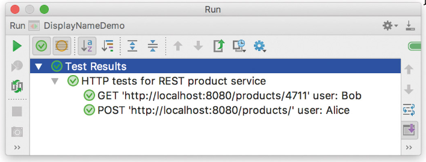

# JUnit Zusammenfassung

## Gängigste Feature

### @DisplayName

Ermöglicht es, fast beliebige Namen für Testklassen und einzelne Testmethoden zu verwenden.

```java
@DisplayName("Testklasse für Benutzerverwaltung")
public class UserManagementTest {
		@Test
		@DisplayName("Soll einen neuen Benutzer erfolgreich erstellen")
		void testCreateUser() {
				// Testcode hier
		}
}
```

Ergibt eine saubere Darstellung in der IDE:



### Parameter Injektion und Test-Reporting

JUnit 5 unterstützt die Injektion von Parametern in Testmethoden, was die Erstellung von flexiblen und wiederverwendbaren Tests erleichtert. Hier sind einige Beispiele für die Parameterinjektion:

```java
@Test
void reporting(TestReporter reporter) {
		reporter.publishEntry("key", "value");
}
```

### Tags und Metaannotationen

JUnit 5 ermöglicht es, Tests mit Tags zu versehen, um sie zu kategorisieren und selektiv auszuführen. Hier ist ein Beispiel:

```java
@Test
@Tag("integration")
void integrationTest() {
		// Integrationstestcode hier
}
```

### Nested Tests

JUnit 5 unterstützt verschachtelte Testklassen, die es ermöglichen, Tests logisch zu gruppieren. Hier ist ein Beispiel:

```java
@DisplayName("A stack") 
public class TestingAStack { 
	Stack<Object> stack;
	@Test 
	@DisplayName("is instantiated with new Stack()") 
	void isInstantiatedWithNew() { new Stack<>(); } 
	
	@Nested 
	@DisplayName("when new") 
	class WhenNew { @BeforeEach void init() { stack = new Stack<>; } 
	
	@Test 
	@DisplayName("is empty") 
	void isEmpty() { Assertions.assertTrue(stack.isEmtpy());}
```

### Dynamische Tests: „@TestFactory” und „@ParameterizedTest”

JUnit 5 bietet die Möglichkeit, dynamische Tests zu erstellen, die zur Laufzeit generiert werden können. Hier ist ein Beispiel für eine Testfabrik:

```java
import static org.junit.jupiter.api.DynamicTest.dynamicTest;

class DynamicFibonacciDemo {
	@TestFactory
	@DisplayName("all Fibonacci are odd")
	Stream<DynamicTest> allFibonacciAreOdd() {
			return IntStream.range(0, 10)
					.mapToObj(n -> dynamicTest("fibonacci of " + n,
							() -> assertTrue(isOdd(fibonacci(n)))));
	}
}
```

Mit der Annotation `@MethodSource` können Parameterisierte Tests erstellt werden:

```java
@ParameterizedTest 
@Methodsource("providerMethod") 
void testWithParametersFromMethods(String parameter) { 
	assertEquals(expected: "two", parameter); 
} 
... 
static Iterable<String> providerMethod() { 
	return asList("one", "two", "three"); 
}
```

### Weitere Features

- Assertions: Umfangreiche Assertions-Bibliothek für verschiedene Testfälle.
```java
assertEquals(expected, actual);
assertTrue(condition);
assertThrows(Exception.class, () -> { /* code that throws */ });
```

- Exception Testing: Einfaches Testen von erwarteten Ausnahmen.
```java
assertThrows(IllegalArgumentException.class, () -> {
		// Code that should throw the exception
});
```

- Timeouts: Unterstützung für Test-Timeouts.
```java
assertTimeout(Duration.ofSeconds(1), () -> {
		// Code that should complete within 1 second
});
```

- Test Lifecycle: Annotations für Setup und Teardown von Tests.
```java
@BeforeEach
void setUp() {
		// Code to set up test environment
}
@AfterEach
void tearDown() {
		// Code to clean up after tests
}
```

- Conditional Test Execution: Tests können basierend auf Bedingungen ausgeführt oder übersprungen werden.
```java
@EnabledOnOs(OS.WINDOWS)
void testOnlyOnWindows() {
		// Test code here
}
@DisabledOnJre(JRE.JAVA_8)
void testNotOnJava8() {
		// Test code here
}
```

- Extensions: Erweiterbares Framework zur Integration von Drittanbieter-Bibliotheken.
```java
@ExtendWith(MyCustomExtension.class)
void testWithExtension() {
		// Test code here
}
```
