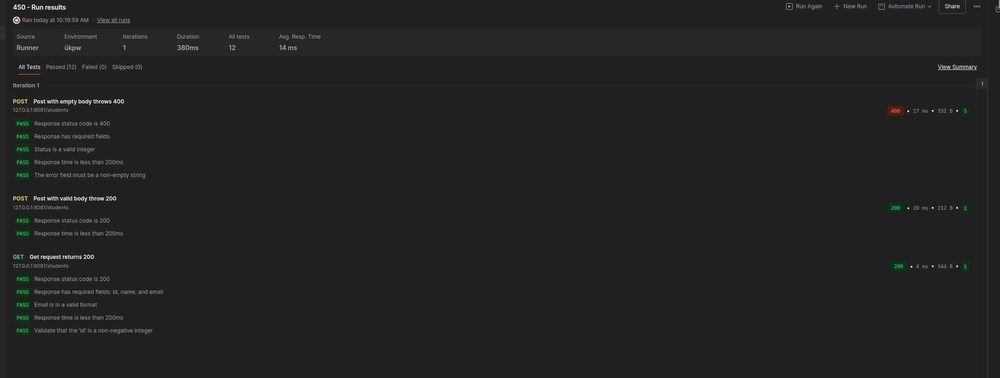
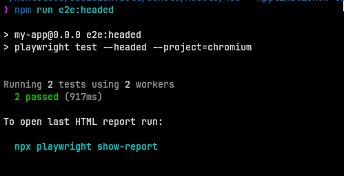
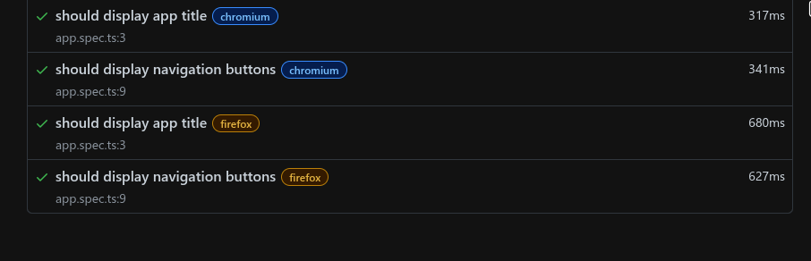
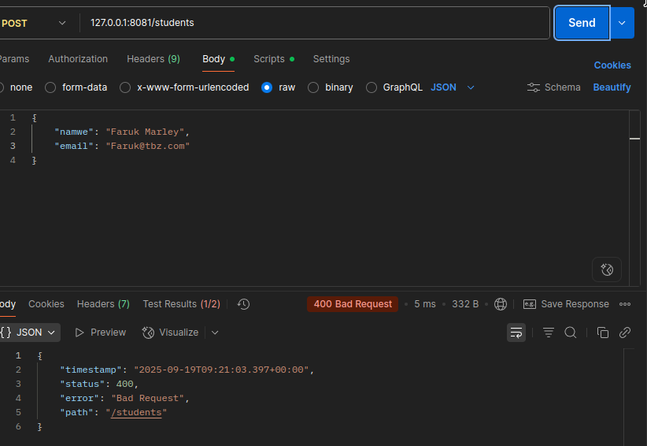
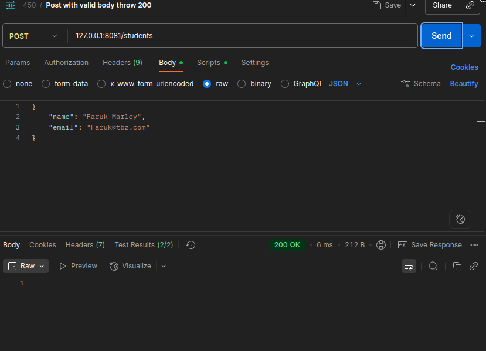

**Date:** 19-09-2025
**Author:** Batuhan Seker
**Tags:** #it #schul-module #testing 
# Test Automation Aufgaben 

## Übung 1

Tests für die **Spring Boot** Applikation wurden mit **Postman** umgesetzt. Es wurden 3 Tests erstellt:

**Route `/students`**:
- Post Request mit leerem Body gibt Response mit Status 400 zurück
- Post mit korrektem Body gibt Response mit Status 200 zurück
- Get Request gibt Response mit Status 200 und einem `JSON` der die Informationen der Studenten erhält



_`Abbildung 1:` Durchlauf der Tests_

---

## Übung 2

Die **Angular** Frontend Applikation wird mit **Playwright** getestet:

```bash
cd my-app
npm i -D @playwright/test
npx playwright install --with-deps
```

`package.json` Scripts:

```json
{
  "scripts": {
    "e2e": "playwright test",
    "e2e:headed": "playwright test --headed --project=chromium",
    "e2e:ui": "playwright test --ui",
    "e2e:report": "playwright show-report"
  }
}

```

`tests/app.spec.ts`:

```typescript
import { expect, test } from "@playwright/test";

test("Page loads", async ({ page }) => {
  await page.goto("/");
  await expect(page.locator('h1')).toBeVisible();
});

test("Navigate to student list", async ({ page }) => {
  await page.goto("/");
  await page.click('a[href="/students"]');
  await expect(page).toHaveURL(/.*\/students/);
  await expect(page.locator('h2')).toContainText('Student List');
});

test("Navigate to add student form", async ({ page }) => {
  await page.goto("/students");
  await page.click('a[href="/addstudent"]');
  await expect(page).toHaveURL(/.*\/addstudent/);
  await expect(page.locator('h2')).toContainText('Add Student');
});

test("Add a new student successfully", async ({ page }) => {
  await page.goto("/addstudent");

  await page.fill('input[name="name"]', 'John Doe');
  await page.fill('input[name="email"]', 'john.doe@example.com');

  await page.click('button[type="submit"]');

  await expect(page).toHaveURL(/.*\/students/);
  await expect(page.locator('.student-list')).toContainText('John Doe');
});

test("Form validation - empty fields", async ({ page }) => {
  await page.goto("/addstudent");

  await page.click('button[type="submit"]');

  const nameField = page.locator('input[name="name"]');
  const emailField = page.locator('input[name="email"]');

  await expect(nameField).toBeInvalid();
  await expect(emailField).toBeInvalid();
});

test("Form validation - invalid email format", async ({ page }) => {
  await page.goto("/addstudent");

  await page.fill('input[name="name"]', 'John Doe');
  await page.fill('input[name="email"]', 'invalid-email');

  await page.click('button[type="submit"]');

  const emailField = page.locator('input[name="email"]');
  await expect(emailField).toBeInvalid();
});

test("Navigation flow - add student and return to list", async ({ page }) => {
  await page.goto("/");

  await page.click('a[href="/students"]');
  await expect(page).toHaveURL(/.*\/students/);

  await page.click('a[href="/addstudent"]');
  await expect(page).toHaveURL(/.*\/addstudent/);

  await page.fill('input[name="name"]', 'Jane Smith');
  await page.fill('input[name="email"]', 'jane.smith@example.com');

  await page.click('button[type="submit"]');
  await expect(page).toHaveURL(/.*\/students/);

  await expect(page.locator('.student-list')).toContainText('Jane Smith');
});

test("Cancel adding student and return to list", async ({ page }) => {
  await page.goto("/addstudent");

  await page.fill('input[name="name"]', 'Test User');
  await page.fill('input[name="email"]', 'test@example.com');

  await page.click('button:has-text("List")');

  await expect(page).toHaveURL(/.*\/students/);
});

test("Student list displays correctly", async ({ page }) => {
  await page.goto("/students");

  await expect(page.locator('h2')).toContainText('Student List');
  await expect(page.locator('a[href="/addstudent"]')).toBeVisible();

  const studentTable = page.locator('.student-table');
  if (await studentTable.isVisible()) {
    await expect(studentTable.locator('th')).toContainText(['Name', 'Email']);
  }
});

test("Handle special characters in student name", async ({ page }) => {
  await page.goto("/addstudent");

  await page.fill('input[name="name"]', 'José María-González');
  await page.fill('input[name="email"]', 'jose.maria@example.com');

  await page.click('button[type="submit"]');

  await expect(page).toHaveURL(/.*\/students/);
  await expect(page.locator('.student-list')).toContainText('José María-González');
});

test("Handle long student name", async ({ page }) => {
  await page.goto("/addstudent");

  const longName = 'A'.repeat(100);
  await page.fill('input[name="name"]', longName);
  await page.fill('input[name="email"]', 'long.name@example.com');

  await page.click('button[type="submit"]');

  await expect(page).toHaveURL(/.*\/students/);
});

test("Application header navigation", async ({ page }) => {
  await page.goto("/");

  await expect(page.locator('nav')).toBeVisible();
  await expect(page.locator('a[href="/"]')).toContainText('Home');
  await expect(page.locator('a[href="/students"]')).toContainText('Students');
});

test("Responsive design - mobile view", async ({ page }) => {
  await page.setViewportSize({ width: 375, height: 667 });
  await page.goto("/");

  await expect(page.locator('h1')).toBeVisible();

  await page.goto("/students");
  await expect(page.locator('h2')).toBeVisible();

  await page.goto("/addstudent");
  await expect(page.locator('form')).toBeVisible();
});
```

### Test Durchlauf






---

## Übung 3

**Kurz:** Ziel war, das Backend (`/students` etc.) mit höherem Traffic zu belasten, Tools zu erkunden und ein reproduzierbares Test-Setup bereitzustellen. Empfohlene Tools: **k6** (leicht, skriptbasiert), **Apache JMeter** (GUI, umfangreich), **Postman Runner / Collection Runner** (einfach, kleinvolumig). Für CI: k6 in GitLab/GitHub Actions oder JMeter im Docker-Image.

### 1. Testumgebung
- Testserver: lokales Dev-/Staging backend unter `http://localhost:8080`
- Endpunkt beispiel: `GET /students`, `POST /students`
- Vorbedingung: saubere DB oder Test-DB. Seeds vorhanden oder klarer teardown.

### 2. Tool-Kurzüberblick

#### k6
- CLI, JS-Skripte, leicht in CI integrierbar.
- Gute Metriken, cloud- oder lokal ausführbar.
- Ideal für Lastprofile.

#### Apache JMeter
- GUI + Non-GUI Modus.
- Komplexe Szenarien, CSV Data-Driven Tests, Assertions, Listeners.
- Schwerer als k6, gut für komplexe Beanspruchungen und Berichtserstellung.

#### Postman (Collection Runner / New-man)
- Einfaches Auslösen von Requests, begrenzte Last (nicht production-grade).
- Gut für Smoke-/Sanity-Tests und funktionale Sequenzen.
- `newman` CLI kann Collections in CI laufen lassen, aber nicht für hohe Last.

### 3. Testdesign (Empfehlung)
1. **Szenarien**
   - Read-heavy: 90% GET `/students`, 10% POST `/students`.
   - Write-heavy: 50% GET, 50% POST.
   - Spike test: schneller Anstieg von 10 → 200 VUs in 30s.
   - Soak test: 50 VUs über 30 Minuten.

2. **Daten**
   - POST-Requests mit eindeutigen Payloads (UUIDs) aus CSV oder JS-Generator.
   - Vorher/ Nachher DB-Cleanup.

3. **Metriken**
   - Durchsatz (req/s)
   - Latenz (p50, p95, p99)
   - Fehlerquote
   - CPU / RAM / GC auf Server
   - DB-Latenz / Verbindungen

### 4. k6 Beispiel (empfohlen)

**Install:**  

```bash
yay -Syu k6      # Auf meinem System
```

> **Infos bereitgestellt von ChatGPT**

---

## Übung 4

Wir implementieren **Error Handling** für `POST /students` Route. Momentan werden die Felder nicht validiert und geben immer den Staus `200` zurück. Wir möchten die Anfragen überprüfen und sicherstellen das `Name`und `Email` gegeben sind und korrekt sind:

### Refactoring 

Wir fügen die Validation dependency ins `pom.xml`hinzu:

```xml
<dependency>
  <groupId>org.springframework.boot</groupId>
  <artifactId>spring-boot-starter-validation</artifactId>
</dependency>
```

Die `Studen.java` Entität wird erweitert. Felder der Klasse werden mit validations Tags versehen:

```java
package ch.tbz.m450.testing.tools.repository.entities;

import jakarta.persistence.Entity;
import jakarta.persistence.GeneratedValue;
import jakarta.persistence.GenerationType;
import jakarta.persistence.Id;
import jakarta.validation.constraints.Email;
import jakarta.validation.constraints.NotBlank;

@Entity
public class Student {

  @Id
  @GeneratedValue(strategy = GenerationType.IDENTITY)
  private Long id;

  @NotBlank(message = "Name ist erforderlich")
  private String name;

  @NotBlank(message = "Email ist erfoderlich")
  @Email(message = "Ungütlige Emai")
  private String email;

  // Required no-argument constructor for JPA
  public Student() {
  }

  // Constructor for creating students with name and email
  public Student(String name, String email) {
    this.name = name;
    this.email = email;
  }

  // Getters (required for JSON serialization)
  public Long getId() {
    return id;
  }

  public String getName() {
    return name;
  }

  public String getEmail() {
    return email;
  }

  // Setters (required for JPA)
  public void setId(Long id) {
    this.id = id;
  }

  public void setName(String name) {
    this.name = name;
  }

  public void setEmail(String email) {
    this.email = email;
  }

  // toString for logging
  @Override
  public String toString() {
    return "Student{id=" + id + ", name='" + name + "', email='" + email + "'}";
  }
}
```

Im `StudenController.java` versehen wir das `user` Argument mit einem `@Valid` Tag:

```java
  @PostMapping("/students")
  void addStudent(@Valid @RequestBody Student user) {
    studentRepository.save(user);
  }
```

### Testen

**Post Request mit einem falschen Wert**:



_**Abbildung 1** Post Request mit falsch geschriebenem Wert Schlüssel_

**Post Request mit korrektem Body**:



_**Abbildung 2** Erfolgreicher Post Request_

