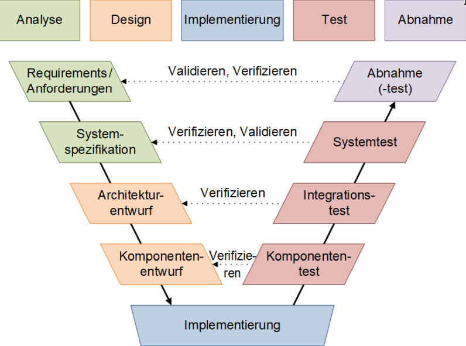
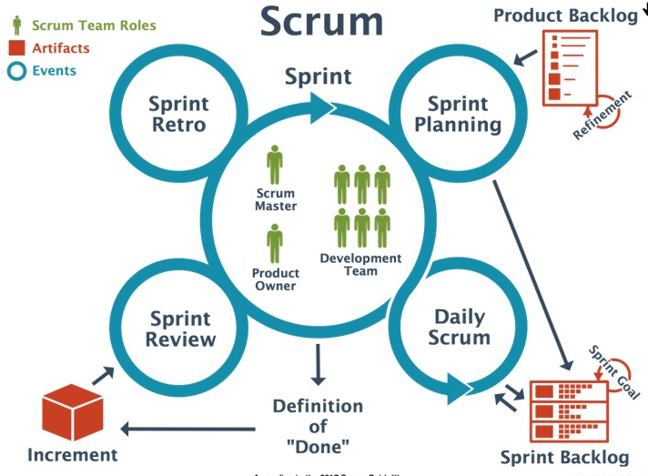

**Date:** 22-08-2025
**Author:** Batuhan Seker
**Tags:** #schule #testing #schul-module
# 1. Grundlagen zu Testing und Testing in Vorgehensmodelle

**Wieso Testen?**: Es ist ein Mittel, um gute Software-Qualität zu erreichen, ist das systematische Prüfen und Testen der entwickelten Software.

## Ursprung in der Produktion

Ansatz der Qualitätsprüfung kommt aus der Industrieproduktion. Es wird geprüft ob das Produkt die geforderte Aufgabe löst. Ist das Produkt fehlerhaft, so müssen entweder Korrekturen in der Herstellung oder in der Konstruktion erfolgen. Testen von Software ist somit sehr wichtig, um die Qualität der einer Software zu gewährleisten.

## Fehler vs Mangel

- **Fehler**: Wenn eine Anforderung nicht erfüllt wird. Wir haben eine Abweichung zwischen dem IST-Verhalten (also was das System während des Tests macht) und dem SOLL-Verhalten (was in der Spezifikation oder in den Anforderungen festgelegt wurde).
- **Mangel**: Ein Mangel liegt vor, wenn eine gestellte Anforderung oder eine berechtigte Erwartung nicht angemessen erfüllt wird. So kann es sein, dass z.Bsp. eine Berechnung korrekt ausgeführt wird, jedoch wird die Berechnung nicht korrekt dargestellt (z.Bsp. in einem GUI).

## Fehlermaskierung

Nicht zu vergessen ist, dass Fehler vielleicht durch andere Teile des Programms kompenisiert werden. Man spricht dann von einer Fehlermaskierung, weil der Fehler nicht sofort erkennbar ist. Der Fehler tritt in diesem Fall erst dann auf, wenn ein anderer Teil des Programms korrigiert worden ist. Fehler können somit in Abhängigkeit zu anderen SW-Teilen entstehen.

Auch kann es sein, dass ein Fehler erst viel später auftritt, z.Bsp. wenn falsch gespeicherte Daten erst später verwendet werden.

## Kann alles getestet werden?

Testen kann Fehlerfreiheit nicht nachweisen. D.h. wir können bei einem Programm nicht alle möglichen Situationen mit allen möglichen Eingaben und unter Berücksichtigung aller unterschiedlichen Randbedingungen testen.  

Die Vielzahl von kombinatorischen Möglichkeiten zeigt eine nahezu unbegrenzte Anzahl an Tests, die durchzuführen wären.

## Kriterien für gute Testfälle

Somit wird immer nur ein Teil aller denkbaren Testfälle ausgeführt. Die Kunst des “richtigen” Testens besteht somit

- Aus Tests, welche eine hohe Wahrscheinlichkeit von Fehler aufzeigen
- Aus Tests, die nicht dasselbe testen (keine Redundanz)
- Aus Tests, die unabhängig voneinander sind
- Aus Tests, die möglichst viel Code abdecken

Wir werden dabei zum letzten Punkt (Codeabdeckung) Werkzeuge kennenlernen, die dem Programmierer dabei helfen, eine möglichst hohe Testabdeckung zu erreichen.

## Testaufwand 

Da ein vollständiger Test nicht möglich ist, muss der Testaufwand in einem vernünftigen Verhältnis zum erzielbaren Ergebnis stehen.

Ganz einfach: Systeme, die einen hohen Schaden bei Fehler verursachen, müssen ausgiebiger getestet werden,als Systeme, welche einen geringen Schaden verursachen. Dabei muss ein “Schaden” nicht bloss ein finanzieller sein – es kann auch einen lebensgefährlichen Schaden verursachen.

## Testing in Vorgehensmodellen

### Das V-Modell als Prototyp für verschiedene Testarten

Das V-Modell ist eine Erweiterung des klassischen "Wasserfallmodells". Hier wurde das Verständnis für Softwaretests nachhaltig verändert.  

Im Wasserfallmodell kommt das Testing ziemlich am Schluss eines Projekts zum Zug. Im V-Modell hingegen, wird das Testen mit der Entwicklung gleichgesetzt.  
  
Dies wird auch bildlich dargestellt in Form eines V (Bilder zum V-Modell gibt es wie Sand am Meer. Wir haben eines ausgesucht, das möglichst dem allgemeinen V-Modell entspricht.

Der **linke Ast** steht für die Entwicklungsschritte, in deren Verlauf das gewünschte System schrittweise und zunehmend detaillierter entworfen und programmiert wird. Diese Schritte sind sehr ähnlich wie im Wasserfallmodell, also aufgegliedert in

- **Anforderungsdefinition** mit den Wünschen und Anforderungen des Auftraggebers
- **Funktionaler Systementwurf** wo die Anforderungen auf Funktionen und Dialoge abgebildet werden
- **Technischer Systementwurf** wo die technische Realisierung entworfen wird (System wird in Komponenten unterteilt, Schnittstellen werden definiert)
- **Komponentenspezifikation**, wo jedes Teilsystem im Detail beschrieben wird
- **Programmierung**, wo jeder Baustein (Modul, Klasse, etc.) in einer Programmiersprache programmiert wird

Der **rechte Ast** zeigt die Integrations- und Testarbeiten, in deren Verlauf elementare Programmbausteine sukzessive zu grösseren Teilsystemen zusammengesetzt (= integriert) werden. Wir haben somit auf jeder Ebene eine bestimmten Test:

- **Komponententest** prüft, ob jeder elementare Softwarebaustein seine Vorgaben erfüllt.
- **Integrationstest** prüft, ob Gruppen von Komponenten korrekt zusammenspielen
- **Systemtest** prüft, ob das System als Ganzes die Anforderungen erfüllt.
- **Abnahmetest** prüft, ob das System vom Kunden als korrekt akzeptiert wird.

Für jede dieser Testarten gibt es unterschiedliche Testmethoden und Testwerkzeuge. Es gibt auch unterschiedliches Personal (z.Bsp. wird sich der Programmierer um den Komponententest kümmern und der Kunde beim Abnahmetest massgeblich beteiligt sein).

Das V-Modell sieht so aus, als ob das Testen erst spät beginnen würde. Dieser Eindruck ist aber falsch. Im V-Modell ist das Testen gleichwertig wie das Entwickeln einer Software. Somit werden diese Teststufen parallel mit der Entwicklung durchgeführt.

## SCRUM als Beispiel für das iterative Testen

Das Produkt wird nicht _an einem Stück_ entwickelt, sondern in einer Abfolge von Versionen. Die Entwicklung wird somit agiler.

Nach jedem _Definition of Done_ wird ein Increment erstellt, welches nach einer Review als _shippable_ oder ausführbar gilt. Das Testen ändert sich natürlich in einem solchen iterativen Vorgang. Für jede Komponente müssen wiederverwendbare Tests vorhanden sein, die bei jedem Inkrement wiederholt werden können. Hier sind **automatisierte Tests** sehr wichtig, denn mit anwachsender Produktfunktionalität müssen immer mehr Testfälle abgearbeitet werden. Wir werden die Test-Automatisierung noch genauer anschauen in diesem Modul (unter [automation-testing](/ch-tbz-it/Stud/m450/m450/-/tree/main/Unterlagen/automation-testing)).