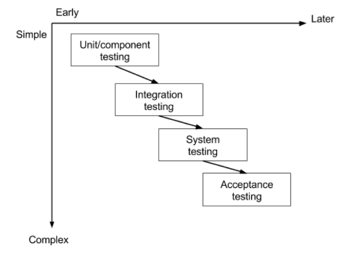

**Date:** 05-09-2025
**Author:** Batuhan Seker
**Tags:**  #testing #schul-module #it 
# 4. Testlevels

## Glossar

| Abkürzung | Erklärung               |
| --------- | ----------------------- |
| Bug       | Software Fehler / Error |
| UAT       | User Acceptance Testing |
| QA        | Quality Assurance       |
| SLA       | Service Level Agreement |

## Einführung

Software Testing kann auf verschiedenen Stufen (levels) stattfinden. Sie hilft, bugs und Mängel in der Implementation früh aufzudecken. Die verschiedenen Stufen, können folgende sein:
- Unit Testing / Component Testing
- Integration Testing
- System Testing
- Acceptance Testing

Hier schauen wir uns an welches Level was abdecken kann. Besonders Unit / Component und Integration Testing werden wir uns im Detail noch speziell anschauen. Im klassischen Fall wird zwar Integration Tests von einem Testing Team ausführt, heutzutage gibt es aber auch Möglichkeiten wie Integration Tests in einem Backend (von Entwickler) ausgeführt werden. **Unit und Component (und eben manchmal heutzutage auch Integration Tests) sind üblicherweise alle Teil eines Builds.** Generell wird jede Stufe von Testing immer zeitintensiver (Unit Tests sollten am schnellsten ausführbar sein) und kommen immer später im Entwicklungsprozess zum Tragen.

### Begrifflichkeiten Erklärung: White Box vs. Black Box testing

Der Begriff **White-Box-Test** bezeichnet eine Methode des Software-Tests, bei der die Tests mit Kenntnissen über die innere Funktionsweise des zu testenden Systems entwickelt werden. Im Gegensatz zum Black-Box-Test ist für diesen Test also ein Blick in den Quellcode gestattet. D.h., es wird am Code geprüft.

Beim **Black-Box-Test** werden Tests anhand der Spezifikation/Anforderung entwickelt. Dies bedeutet, dass Tests ohne Kenntnisse über die innere Funktionsweise/Implementierung des zu testenden Systems entwickelt werden. Das zu testende Programm wird also als Black Box behandelt. Nur nach aussen sichtbares Verhalten fliesst in den Test ein.

Sprich jeder dieser Levels, die wir unten genauer anschauen, kann entweder aus einer White-Box oder aus einer Black-Box Sicht getestet werden. Gewisse Levels werden zum Teil auch aus beiden Sichten getestet.

---

## Unit Testing

- Gehört zum ersten Level von Testing
- Wird von den Entwicklern geschrieben und ausgeführt (später automatisiert beim build oder beim deployment, sofern kein build nötig ist wie bei Skript-Sprachen)
- White-Box-Test
- Komponenten werden einzeln in Isolation getestet (in Java Klassen oder Methoden)
- Fehler werden früh entdeckt
- Gibt den Entwickler die Sicherheit für Code Refactoring
- Hauptsächlich funktionale Anforderungen werden hier getestet

--- 

## Component Testing

- Wird manchmal zum Unit Testing Level dazu gezählt
- Von Entwickler geschrieben und ausgeführt
- White-Box-Test
- Hier wird das Zusammenspiel zwischen mehreren Komponenten getestet
- Schnittstellen jedoch wie z.B. zu einer Datenbank werden hier gemockt
	- Andere Beispiele von Schnittstellen
		- Externe APIs
		- Message queues

---
## Integration Testing

- Wird von einem Tester (oder ganzes QA Team) ausgeführt
- Black-Box-Test
- Hier werden Integration wie z.B. zu einer Datenbank (oder APIs / Message queues) nicht mehr gemockt, sonder aktiv benutzt
- Beispiel: Der Tester ruft eine API auf, welche dann auf einer Datenbank einen Zugriff macht (der Tester kennt das Innere der API jedoch nicht)

> [!Notiz]
>
> Wie vorher schon erwähnt, gibt es auch Integration Tests, welche von Entwicklern geschrieben und ausgeführt werden. Hier wäre es dann ein White-Box-Test.

---

## System Testing

- Wird von den gleichen Teams, welche die Integrations Tests gemacht haben, getestet
- Black-Box-Test
- Hier wird die Software als ganzes getestet, um sicherzustellen, dass alle Requirements erfüllt sind
- Eine Umgebung die möglichst nahe an der **Live** Umgebung ist, wird hier benutzt
- Funktionale und Nichtfunktionale Anforderungen werden hier getestet
- Nichtfunktionale Tests wären hier zum Beispiel:
    - Performance Testing um [Bottlenecks](https://en.wikipedia.org/wiki/Bottleneck_\(software\)) bezüglich Performanz zu finden. Hier kann nochmals zwischen folgenden Testarten unterschieden werden:
        - Load Testing -> Um zu verstehen wie sich die Software z.B. bei einer gesetzten Anzahl an Requests verhält
        - Stress Testing -> Um ein Limit der Software zu wissen
    - Usability Testing um Fehler oder Verbesserungen zu finden, in dem man den Benutzer beobachtet wie er die Software bedient
    - Security Testing um z.B. zu Testen, ob die Authentifizierung sicher ist

---

## Acceptance Testing

- Wird in der Regel vom Business / Kunden getestet
- Black-Box-Test
- Hier wird vom Kunden sichergestellt, ob das System die Akzeptanz Kriterien erfüllt

**Notiz:** Acceptance Testing kann auch in verschiedene Typen unterteilt werden, auf die wir aber hier nicht mehr näher eingehen.

### Recap

Wichtig ist zu wissen, wo der Entwickler und wo der Tester in der Regel ansetzt. Alle Testing Levels bauen aufeinander auf. Es fängt an, bei den kleinsten (unit) und schnellsten Tests und abstrahiert bei jedem Schritt immer ein bisschen mehr.

