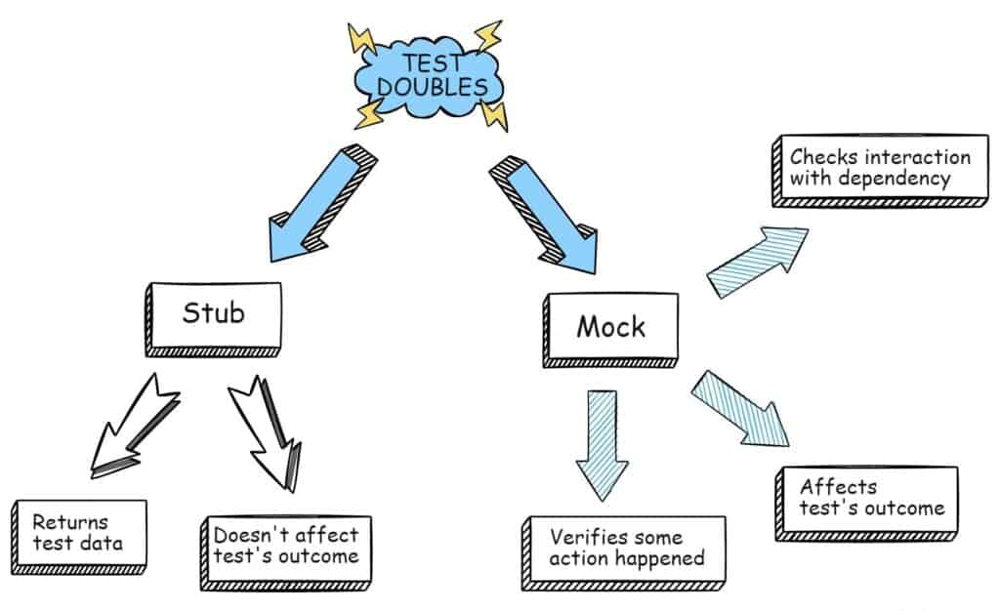
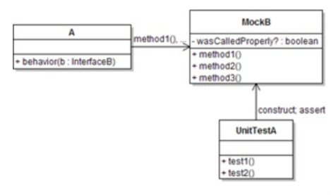
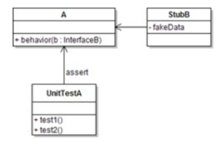
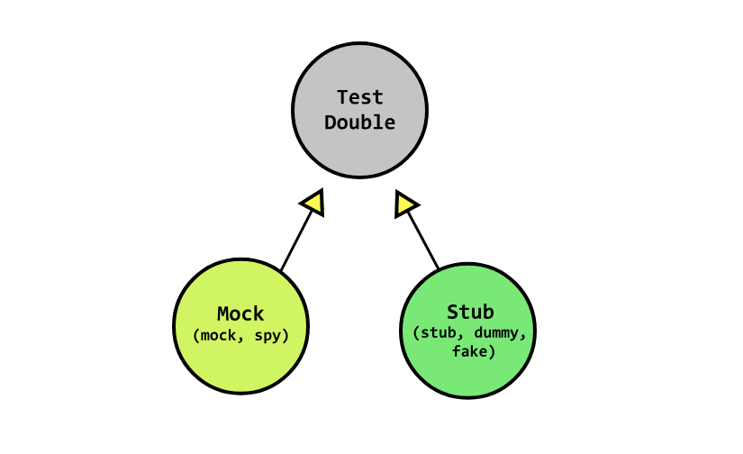

**Date:** 12-09-2025
**Author:** Batuhan Seker
**Tags:** #testing #schul-module 
# 6. Schnittstellen

## Test Doubles

**Test Doubles** werden in zwei Hauptkategorien aufgeteilt:
- Mock (mock, spy)
- Stub (stub, dummy, fake)

Beim Testen soll sie alle Abhängigkeiten einer Klasse oder Funktion eliminieren.

- Ein **Mock** wartet darauf, von der zu testenden Klasse (A) aufgerufen zu werden.
    - Vielleicht hat sie mehrere Methoden, die sie erwartet und die A aufrufen sollte.
- Sie stellt sicher, dass sie auf genau die richtige Weise kontaktiert wurde.
    - Wenn A mit B so interagiert, wie es sein sollte, ist der Test erfolgreich.

- Ein **Stub** gibt Daten aus, die an die zu testende Klasse/das zu testende Objekt gehen.
- Der Unit-Test überprüft direkt die zu testende Klasse, um sicherzustellen, dass er das richtige Ergebnis liefert, wenn er mit diesen Daten gefüttert wird

### Lifecycle

| Stubs                                                                              | Mocks                                                                                                                 |
| ---------------------------------------------------------------------------------- | --------------------------------------------------------------------------------------------------------------------- |
| 1. Setup - Bereiten Sie das zu testende Objekt und seine Stubs-Kollaborateure vor. | 1. Daten einrichten - Bereiten Sie das zu testende Objekt vor.                                                        |
| 2. Anwenden - Testen Sie die Funktionalität.                                       | 2. **Setup expectations** - Bereiten Sie die Erwartungen in der Attrappe vor, die vom primären Objekt verwendet wird. |
| 3. Verify state - Verwenden Sie Asserts, um den Zustand des Objekts zu überprüfen. | 3. Anwenden - Testen Sie die Funktionalität.                                                                          |
| 4. Teardown - Aufräumen der Ressourcen.                                            | 4. **Verify expectations** - Überprüfen Sie, ob die richtigen Methoden im Mock aufgerufen wurden.                     |
|                                                                                    | 5. Verify state - Verwenden Sie Asserts, um den Zustand des Objekts zu überprüfen.                                    |
|                                                                                    | 6. Teardown - Aufräumen der Ressourcen.                                                                               |
|                                                                                    |                                                                                                                       |
## Mock, Spy Stub, Fake, Dummy

---

### Mock
Mocks sind Objekte, denen man sagen kann, was sie zu empfangen erwarten. Sie werden verwendet, um das Verhalten
zwischen dem zu testenden System und seinen Kollaborateuren zu verifizieren.
Sie setzen Ihre Erwartungen, rufen die Methode des SUT auf und überprüfen, ob die Methode am Ende aufgerufen wurde.
### Spy
Stellen Sie sich einen Spy wie jemanden vor, der sich in Ihren SUT eingeschleust hat und jede seiner Bewegungen
aufzeichnet, genau wie ein echter Spion. Im Gegensatz zu Mocks schweigt der Spion und es liegt an Ihnen, anhand der
Daten, die er liefert, Aussagen zu treffen.
Sie verwenden Spione, wenn Sie sich nicht sicher sind, was Ihr SUT von Ihrem Mitarbeiter abrufen wird, also zeichnen Sie alles auf und stellen fest, ob der Spion die gewünschten Daten abgerufen hat.
### Dummy
Dummy-Objekte sind sehr simpel. Ein Dummy ist z.B. nur ein Objekt, das Sie übergeben, um einen Konstruktor zu initialisieren.
Das kann etwas Einfaches sein wie z.B. einen 'null'-Wert als Parameter mitgegeben. Es wird keine Methode implementiert.
### Stub
Ein Stub ist ein Objekt, das vordefinierte Daten enthält und diese zur Beantwortung von Aufrufen während der Tests
verwendet. Es wird verwendet, wenn wir keine Objekte einbeziehen können oder wollen, die mit echten Daten antworten
würden oder unerwünschte Nebeneffekte hätten.
Ein Beispiel ist ein Objekt, das Daten aus der Datenbank abrufen muss, um auf einen Methodenaufruf zu reagieren.
Anstelle des echten Objekts haben wir einen Stub eingeführt und definiert, welche Daten zurückgegeben werden sollen. Die
Daten sind meistens sehr simpel und hardcoded.
### Fake
Fakes sind Objekte, die funktionierende Implementierungen haben, die aber nicht mit dem Produktionscode übereinstimmen.
Stub und Fakes sind sehr ähnlich. Fakes sind jedoch naher an einer realen Implementierung als ein Stub. Normalerweise
nehmen sie eine Abkürzung und haben
eine vereinfachte Version des Produktionscodes.
Ein Beispiel für eine solche Abkürzung ist eine In-Memory-Implementierung von Data Access Object oder Repository. Diese
Fake-Implementierung greift nicht auf eine Datenbank zu, sondern verwendet eine einfache Sammlung zum Speichern von
Daten (zum Beispiel gefeedet aus einem CSV file). So können wir Integrationstests von Diensten durchführen, ohne eine
Datenbank zu starten und zeitaufwändige Anfragen durchzuführen.
---
## Mockito - alles in einem

Nicht nur Mockito, sondern die meisten Mocking-Frameworks haben dieses Enten-Syndrom, bei dem sie mehrere Dinge tun
können: eine Ente kann schwimmen, fliegen und laufen. Diese Frameworks arbeiten mit Dummies, Mocks, Spys und Stubs.
* Lesen Sie das [Mockito Tutorial](https://www.vogella.com/tutorials/Mockito/article.html) bis und mit dem 9. Kapitel
## Sonstige Use Cases
Zusätzlich gibt es auch Frameworks, welche einen HTTP mock server initialisieren und so einem ermöglichen API's zu mocken
und HTTP Responses zu stubben. Eine Variante dafür wäre z.B. [WireMock](https://wiremock.org/)
---
## Source
* https://stackoverflow.com/questions/3459287/whats-the-difference-between-a-mock-stub
* https://stackoverflow.com/questions/346372/whats-the-difference-between-faking-mocking-and-stubbing
* https://methodpoet.com/stub-vs-mock/
* https://blog.pragmatists.com/test-doubles-fakes-mocks-and-stubs-1a7491dfa3da
* https://www.javacodegeeks.com/2019/04/introduction-to-test-doubles.html
# Checkpoint
* Ich kann die zwei Hauptkategorien Mocks und Stubs unterscheiden
* Ich kenne die Unterschiede des Lifecycles
* Ich kenne die jeweiligen Test Doubles und weiss was für eine Aufgabe Sie übernehmen
  * Mock, Spy, Stub, Fake, Dummy
* Ich habe erste Erfahrungen mit Mockito gemacht